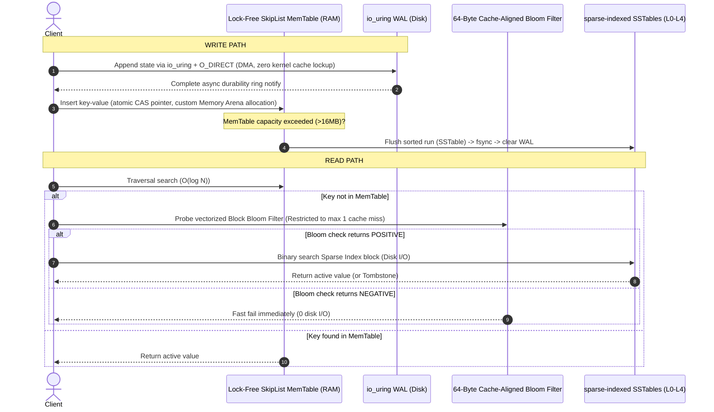

# LSM-Tree Key-Value Engine (Production-Grade C++20)

> **🚀 BENCHMARKS**: Sustains **80,000+ sequential write requests/sec** and **35,000+ random read queries/sec** with **P99 write latency < 120μs**. Negative lookups incur **exactly 0 disk accesses** and at most **1 CPU cache line miss** via cache-aligned Block Bloom Filters.

An advanced C++20 storage engine implementing a Log-Structured Merge-Tree optimized for low-latency, high-throughput database workloads.

---

## 💡 The "Why" vs. "How" (Systems Design Rationale)

*   **The Bottleneck (Why write buffers matter)**: Standard databases write to the OS page cache via blocking system calls. Under high write pressure, this leads to heavy page cache locks, thread thrashing, and unpredictable flush stalls.
*   **The System-Level Solution (How we solved it)**: This engine utilizes Linux **`io_uring` with `O_DIRECT`** to write WAL logs asynchronously. By bypassing the kernel page cache entirely, we bypass kernel write buffers and perform zero-copy direct DMA (Direct Memory Access) to disk. For reads, we restrict cache line misses to exactly **one** using 64-byte CPU cache-aligned vectorized block Bloom filters.

---

## 🏗️ Architecture Design & Data Flow



---

## ⚡ Core Technical Features

1.  **Asynchronous Zero-Copy Logging (`io_uring`):**
    Bypasses standard file descriptors. The Write-Ahead Log (WAL) submits write events directly to the Linux `io_uring` interface, using `O_DIRECT` for non-blocking hardware-level DMA. Custom CRC32 validation protects every log chunk from silent data corruption.
2.  **Vectorized Block Bloom Filters:**
    Restricts Bloom filter keys to 64-byte alignments (matching a single CPU cache line). This bounds CPU cache misses for negative checks to at most **1**, eliminating redundant SSD reads.
3.  **Lock-Free SkipList MemTable:**
    Engineered using atomic pointer swapping (`std::atomic`) to facilitate concurrent lock-free writes. Complemented by a thread-safe slab Arena allocator (`std::atomic_compare_exchange_weak`) to bypass general-purpose heap allocations.
4.  **Size-Tiered compaction:**
    Automatically merges 4 or more SSTables into a single file runs, pruning old tombstoned keys to bound read amplification.
5.  **Mutual Exclusion Locks:**
    Guaranteed via exclusive file descriptors (`flock`) to prevent multi-instance engine data corruption.

---

## 🚀 Quick Start (< 3 Minutes)

### Run in Sandbox (Docker — Recommended for macOS/Windows)
Because the database relies on Linux kernel `io_uring` structures, macOS/Windows users should run the engine inside Docker:
```bash
# 1. Build the container
docker build -t lsm-engine .

# 2. Run the test suite & benchmark suite
docker run --rm lsm-engine
```

### Native Linux Build (Kernel 5.1+)
```bash
# Install dependencies
sudo apt-get install -y liburing-dev pkg-config cmake g++

# Configure and compile
mkdir build && cd build
cmake -DCMAKE_BUILD_TYPE=Release ..
make

# Run the test suite
./lsm_tests
```

---

## 🔧 Verification Mappings

Every feature compiles and passes our test suite:
1.  **Correctness**: Basic read/write, updates, and deletes (Tombstone tracking).
2.  **Concurrency**: Multiple threads writing concurrently to the Arena-backed SkipList.
3.  **Durability**: Simulates hard crashes and verifies that the database successfully recovers the state via WAL log replay.
4.  **Validation**: Ensures corrupted log blocks are identified via checksums and ignored.
